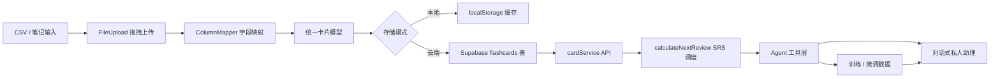

# 手把手打造闪记卡 AI Agent

> 按照“搭建记忆底座 → 打通 Supabase → 注入 SRS → 接入 AI Agent → 微调私人助理”五大阶段教学，直接基于本仓库即可复刻全流程。

## 流程蓝图（含 AI Agent）



## 0. 准备工作

- Node.js 16+、npm，以及 Supabase 账号（或任何兼容 Postgres 的后端）。
- 在 `.env` 中配置 `VITE_SUPABASE_URL` 与 `VITE_SUPABASE_ANON_KEY`。
- Supabase 表 `flashcards` 需要字段：`id`, `user_id`, `front`, `back`, `tags` (text[]), `review_count`, `next_review_date`, `created_at`。

---

## Step 1. 启动闪记卡基础应用

1. 克隆仓库并启动：
   ```bash
   git clone <repo-url>
   cd flashcard-app
   npm install
   npm run dev
   ```
2. 浏览器访问 `http://localhost:5173`，先体验 Landing Page，再点击“开始使用”进入实际应用。
3. 熟悉 UI：`Library` 是复习控制中心，`Graph` 呈现知识簇，`Study` 页承载背诵体验。

---

## Step 2. 从 CSV 搭建结构化卡片管线

1. 在 `FileUpload` 组件拖拽或点击导入 CSV，`handleFileUpload` 负责读取与解析。
2. 进入 `ColumnMapper`，手动映射题面、答案和分类，可设置固定分类以便后续 SRS 过滤。
3. `handleImport` 把每一行转换成统一卡片模型，并决定是本地写入还是调用云端 API：

```122:179:src/App.jsx
  const handleFileUpload = (file) => {
    const reader = new FileReader();
    reader.onload = (e) => {
      const text = e.target.result;
      const parsed = parseCSV(text);
      if (parsed.data.length > 0) {
        setCsvData(parsed);
        setStep('map');
      } else {
        alert('CSV file is empty or invalid');
      }
    };
    reader.readAsText(file);
  };

  const handleImport = async (frontCol, backCol, categoryCol, customCategory) => {
    const newCards = csvData.data.map(row => {
      let category = 'Uncategorized';
      if (customCategory) {
        category = customCategory;
      } else if (categoryCol >= 0) {
        category = row[categoryCol] || 'Uncategorized';
      }

      return {
        id: user ? undefined : Date.now() + Math.random().toString(36).substr(2, 9), // Let DB generate ID if cloud
        front: row[frontCol] || '',
        back: row[backCol] || '',
        category: category,
        tags: [category], // Ensure tags are set for Supabase
        difficulty: null,
        lastReviewed: null
      };
    }).filter(card => card.front && card.back);

    if (newCards.length === 0) {
      alert('No valid cards found');
      return;
    }

    if (user) {
      // Cloud Import
      try {
        const promises = newCards.map(card => cardService.addCard(card, user));
        await Promise.all(promises);
        // Refresh data
        const cloudCards = await cardService.getCards(user);
        setAllFlashcards(cloudCards);
      } catch (error) {
        console.error('Import error:', error);
        alert('Error saving to cloud');
      }
    } else {
      // Local Import
      setAllFlashcards(prev => [...prev, ...newCards]);
    }
    setStep('library');
  };
```

> 提示：可以新增“AI 生成”按钮，调用 LLM 根据长文本自动产出 CSV，以便继续复用这条导入管线。

---

## Step 3. 同时支持本地缓存与 Supabase 云端

- 离线场景使用浏览器 `localStorage`，相关逻辑在 `src/utils/storage.js`：

```1:24:src/utils/storage.js
const STORAGE_KEY = 'flashcards_data';

export const saveFlashcards = (cards) => {
    try {
        localStorage.setItem(STORAGE_KEY, JSON.stringify(cards));
    } catch (error) {
        console.error('Failed to save flashcards:', error);
    }
};

export const loadFlashcards = () => {
    try {
        const data = localStorage.getItem(STORAGE_KEY);
        return data ? JSON.parse(data) : [];
    } catch (error) {
        console.error('Failed to load flashcards:', error);
        return [];
    }
};

export const clearFlashcards = () => {
    localStorage.removeItem(STORAGE_KEY);
};
```

- 登录后切换到 Supabase：`cardService` 暴露 `getCards / addCard / updateCard / getDueCards` 等方法，天然可复用为 Agent 的 Tool：

```16:130:src/services/cardService.js
export const cardService = {
    // Fetch cards from Supabase or fallback
    async getCards(user) {
        if (!user) return []; // Or handle local storage fallback here if we want mixed mode

        const { data, error } = await supabase
            .from('flashcards')
            .select('*')
            .order('created_at', { ascending: false });

        if (error) throw error;

        // Normalize data for frontend (map tags to category)
        return data.map(card => ({
            ...card,
            category: card.tags && card.tags.length > 0 ? card.tags[0] : 'Uncategorized'
        }));
    },

    async addCard(card, user) {
        if (!user) throw new Error('User must be logged in');

        const { data, error } = await supabase
            .from('flashcards')
            .insert([
                {
                    user_id: user.id,
                    front: card.front,
                    back: card.back,
                    tags: card.tags || [],
                    review_count: 0,
                    // next_review_date defaults to now() in DB
                }
            ])
            .select();

        if (error) throw error;
        return data[0];
    },

    async updateCard(id, updates) {
        const { data, error } = await supabase
            .from('flashcards')
            .update(updates)
            .eq('id', id)
            .select();

        if (error) throw error;
        return data[0];
    },
    ...
```

> 小技巧：`Library` 中的“Sync Local to Cloud” 按钮已经示范了如何批量把离线卡片推送到 Supabase。

---

## Step 4. 注入 SRS 大脑

1. **计算复习节奏**：`calculateNextReview` 依据难度评级动态拉长/缩短间隔。

```4:29:src/utils/srsAlgorithm.js
export const calculateNextReview = (currentInterval, rating) => {
    // rating: 'easy', 'medium', 'hard'
    // currentInterval: days since last review (or 0 if new)

    let nextInterval = 1;

    if (rating === 'hard') {
        // Reset or keep short
        nextInterval = 1;
    } else if (rating === 'medium') {
        // 1.5x expansion or minimum 2 days
        nextInterval = Math.max(2, Math.ceil(currentInterval * 1.5));
    } else if (rating === 'easy') {
        // 2.5x expansion or minimum 4 days
        if (currentInterval === 0) nextInterval = 4;
        else nextInterval = Math.ceil(currentInterval * 2.5);
    }

    // Calculate date
    const nextDate = new Date();
    nextDate.setDate(nextDate.getDate() + nextInterval);

    return {
        nextReviewDate: nextDate.toISOString(),
        interval: nextInterval
    };
};
```

2. **派发待复习任务**：`cardService.getDueCards` 先取到期卡片，再用“从未复习”的卡补齐数量，天然可被 Agent 调用：

```76:112:src/services/cardService.js
    async getDueCards(user, limit = 20) {
        if (!user) return [];

        const now = new Date().toISOString();

        // 1. Fetch cards due for review
        const { data: dueCards, error: dueError } = await supabase
            .from('flashcards')
            .select('*')
            .lte('next_review_date', now)
            .order('next_review_date', { ascending: true })
            .limit(limit);

        if (dueError) throw dueError;

        let cards = dueCards || [];

        // 2. If not enough, fill with new cards (review_count = 0)
        if (cards.length < limit) {
            const remaining = limit - cards.length;
            const { data: newCards, error: newError } = await supabase
                .from('flashcards')
                .select('*')
                .eq('review_count', 0)
                .limit(remaining);

            if (!newError && newCards) {
                cards = [...cards, ...newCards];
            }
        }

        // Normalize
        return cards.map(card => ({
            ...card,
            category: card.tags && card.tags.length > 0 ? card.tags[0] : 'Uncategorized'
        }));
    },
```

3. **体验验证**：在 Library 切换到 “Smart Review (SRS)” 即可调用这套流程；也可以在浏览器 Network 面板观察 Supabase 请求。

---

## Step 5. 把系统包装成 AI Agent 可调用的工具

### 5.1 构建知识检索层（RAG）
- 周期性把 `flashcards` 导出为 JSONL，并用 `front + back + tags` 拼接后的文本生成 embedding。
- 可选方案：Supabase Vector、Pinecone、Weaviate，或把 embedding 存回 Supabase 的向量列。
- Agent 的 `search_notes` 工具即可基于该向量库做语义召回。

### 5.2 暴露动作型 Tool

用 Node + Supabase Service Key 写一层 API/SDK，暴露给 Agent：

```js
// agent/tools/cardTools.js
import { cardService } from '../src/services/cardService.js';

export const listDueCardsTool = {
  name: 'list_due_cards',
  description: '获取今天需要复习的卡片，返回 front/back/tags',
  func: async ({ user, limit = 15 }) => cardService.getDueCards(user, limit)
};

export const addCardTool = {
  name: 'add_card_from_text',
  description: '根据上下文生成问答并写入 Supabase',
  func: async ({ user, front, back, tags }) =>
    cardService.addCard({ front, back, tags }, user)
};
```

### 5.3 组装一个多工具 Agent

```js
// agent/index.js
import { ChatOpenAI } from '@langchain/openai';
import { initializeAgentExecutor } from 'langchain/agents';
import { listDueCardsTool, addCardTool } from './tools/cardTools.js';
import { ragSearchTool } from './tools/rag.js';

const llm = new ChatOpenAI({ model: 'gpt-4o-mini', temperature: 0.2 });
const tools = [listDueCardsTool, addCardTool, ragSearchTool];
const executor = await initializeAgentExecutor(tools, llm, {
  agentType: 'openai-functions',
  verbose: true
});

const res = await executor.invoke({
  input: '帮我安排今晚 20 分钟的复习，并把“Transformer”笔记生成 3 张卡片'
});
console.log(res.output);
```

- 在前端，可以通过 `supabase.auth.getSession()` 拿到当前用户信息，将 `access_token` 传给 Agent 服务端，以执行行级安全策略。
- 若想在浏览器直接运行 Agent，可把工具换成 HTTP API（由 Cloudflare Worker / Supabase Edge Function 暴露）。

---

## Step 6. 训练 / 微调你的私人助理

1. **数据蒸馏**：把用户对卡片的评分（Easy/Medium/Hard）、复习时长、Agent 的答复一起记录成 `instruction / input / output` 样本。
2. **自动扩充样本**：用主模型生成“同义卡片”“错题解析”“类比故事”，并人工抽检，形成更丰富的 Prompt。
3. **LoRA/QLoRA 微调流程**：
   - 准备格式化数据（如 Alpaca 格式）。
   - 选择模型（Qwen2.5 7B、Llama 3.1 8B 等），使用 `unsloth`、`axolotl` 或 `lmflow` 跑 LoRA。
   - 把 Adapter 部署到 GPU 服务（AWS g5、RunPod）或本地显卡，前端通过推理 API 与之交互。
4. **在线对齐**：Supabase 的 Audit Log 可记录 Agent 建议和真实复习效果，用于事后评估或 RLHF。

---

## Step 7. 测试、部署与持续演进

- **自动化构建**：仓库自带 GitHub Pages 工作流，推送 `main` 即可上线静态站。
- **监控 & 提示**：使用 Supabase Edge Function 每日扫描 `next_review_date`，触发邮件/推送或直接唤起 Agent 主动问候。
- **多 Agent 协作**：拆分“资料整理 Agent”“复习导师 Agent”“情绪陪伴 Agent”，分别使用不同 Tool，但共享同一知识库与 Supabase。
- **产品化细节**：在 `Library` 增加 AI 建议面板，把 Agent 输出串联到 UI，形成“下一步学什么”的即时推荐。

---

借助本教程，你可以从零重用该 React + Supabase 闪记卡项目，逐步延伸到具备 SRS 能力、懂个人语境、还能自我训练的 AI 学习 Agent。跟着步骤完成后，你就拥有了一个可持续扩展的“学习操作系统”，后续只需迭代 Tool 与模型，就能不断增强专属的私人助理体验。
